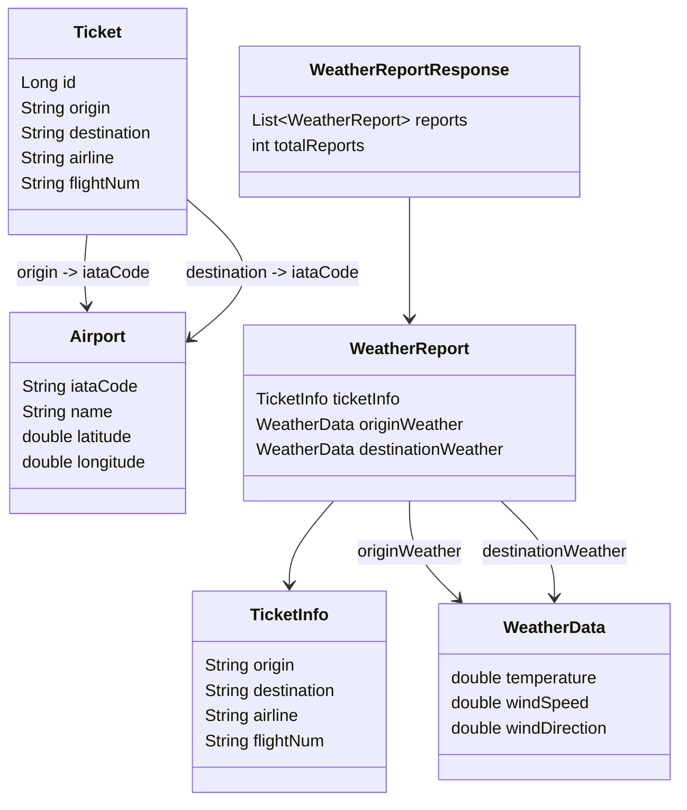

# ms-weather-report-api-service

Este proyecto es una aplicación Spring Boot que genera reportes meteorológicos para varios boletos de vuelo. Se integra con la API de Open Meteo para obtener los datos del clima en los orígenes y destinos de los vuelos, y proporciona los informes a través de endpoints REST.

## Características

- **Configuración CORS**: Permite solicitudes de origen cruzado.
- **Documentación OpenAPI**: Integración de Swagger para documentar la API.
- **Caché**: Habilita la caché para mejorar el rendimiento.
- **WebClient Reactivo**: Realiza llamadas HTTP no bloqueantes a la API de Open Meteo.
- **Integración con Base de Datos**: Usa JPA para almacenar y gestionar la información de aeropuertos y boletos.

## Endpoints de la API

1. `GET /api/generate-report` - Genera reportes meteorológicos para todos los boletos.

## Primeros Pasos

### Requisitos Previos

- Java 1.8 o superior
- Maven
- H2 (en desarrollo)

### Ejecutar la Aplicación

```bash
mvn spring-boot:run
```

### Variables de Entorno

- `weather.api.base-path`: Ruta base para las APIs de reportes meteorológicos.
- `weather.api.generate-report-endpoint`: Endpoint para generar reportes meteorológicos.
- `weather.api.base-url`: La URL base para la API de Open Meteo.
- `webclient.connect-timeout`: Tiempo de espera de conexión para el WebClient.
- `webclient.response-timeout`: Tiempo de espera de respuesta para el WebClient.
- `webclient.retry.attempts`: Número de intentos de reintento.
- `webclient.retry.delay`: Retraso entre los intentos de reintento.

## Diagrama de Entidades



## Clases y Componentes Clave

- **`CorsConfig`**: Configura las reglas CORS.
- **`OpenApiConfig`**: Configura la documentación Swagger/OpenAPI.
- **`WebClientConfig`**: Configura el WebClient para realizar llamadas a APIs externas (Open Meteo API).
- **`CacheConfig`**: Habilita la caché para mejorar el rendimiento.
- **`ReportController`**: Expone los endpoints REST para generar reportes meteorológicos.
- **`ReportGeneratorService`**: Contiene la lógica de negocio para generar reportes.
- **`AirportRepository`**: Repositorio JPA para gestionar entidades `Airport`.
- **`TicketRepository`**: Repositorio JPA para gestionar entidades `Ticket`.

## Manejo de Excepciones

El proyecto incluye un manejador global de excepciones personalizado para gestionar diversas excepciones, como `AirportNotFoundException`, `TicketNotFoundException` y excepciones generales en tiempo de ejecución.